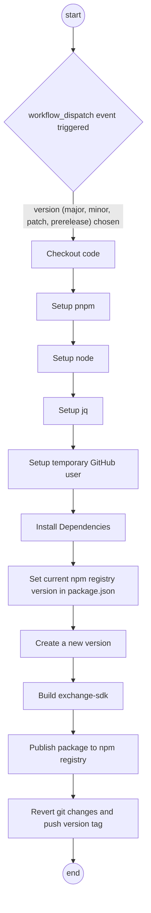

### Workflows

```mermaid
graph TB
     A((start)) --> B{workflow_dispatch event triggered}
     
     B -- "version (major, minor, patch, prerelease) chosen" --> C[Checkout code]
     C --> D[Setup pnpm]
     D --> E[Setup node]
     E --> F[Setup jq]
     F --> G[Setup temporary GitHub user]
     G --> H[Install Dependencies]
     H --> I[Set current npm registry version in package.json]
     I --> J[Create a new version]
     J --> K[Build exchange-sdk]
     K --> L[Publish package to npm registry]
     L --> M[Revert git changes and push version tag]
     M --> N((end))
```