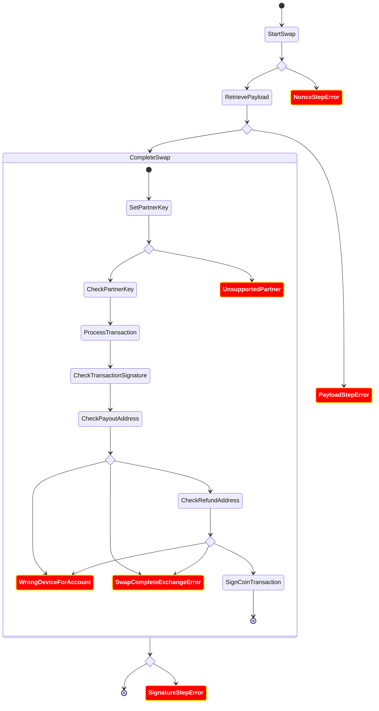

# Error Management
## General flow

## Error objects
The ExchangeSDK can throw differents kind of errors:
  * NotEnoughFunds: if the user has not enough funds to start the swap transaction
  * NonceStepError: if an error occurred during the *nonce* generation
  * PayloadStepError: if an error occurred during the payload retrieve flow (communication with Ledger and the Provider backends)
  * SignatureStepError: if an error occured during the signature flow

All those errors (except *NotEnoughFunds*) embed the root error/cause.

### SwapCompleteExchangeError case
The `SwapCompleteExchangeError` within LL is a conversion of a device error.

It contains:
  * the step where the error occured (see `CompleteSwap` above)
  * a human readable error from the app-exchange

This last error is define [app-exchange wrapper](https://github.com/LedgerHQ/ledger-live/blob/develop/libs/ledgerjs/packages/hw-app-exchange/src/Exchange.ts) one among:
  * INCORRECT_COMMAND_DATA: "Incorrect command data"
  * DESERIALIZATION_FAILED: "Payload deserialzation failed"
  * WRONG_TRANSACTION_ID: "Wrond transaction id"
  * INVALID_ADDRESS: "Invalid address"
  * USER_REFUSED: "User refused"
  * INTERNAL_ERROR: "Internal error"
  * WRONG_P1: "Wrong P1"
  * WRONG_P2: "Wrong P2"
  * CLASS_NOT_SUPPORTED: "Class not supported"
  * INVALID_INSTRUCTION: "Invalid instruction"
  * SIGN_VERIFICATION_FAIL: "Signature verification failed"
