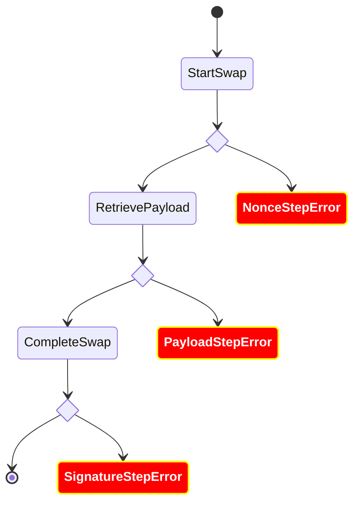

# Error Management
## General flow

## Error objects
The ExchangeSDK can throw differents kind of errors:
  * ExchangeError: generic exchange error
  * NotEnoughFunds: if the user has not enough funds to start the swap transaction
  * NonceStepError: if an error occurred during the *nonce* generation
  * PayloadStepError: if an error occurred during the payload retrieve flow (communication with Ledger and the Provider backends)
  * SignatureStepError: if an error occured during the signature flow
  * ListAccountError: unable to retrieve account list
  * ListCurrencyError: unable to retrieve list currency
  * UnknownAccountError: unable to find from/to account in user account/currency list
  * CancelStepError: cancel backend swap call is failing
  * ConfirmStepError: confirm backend swap call is failing

All those errors (except *NotEnoughFunds*) embed the root error/cause.

## Contributors
For more details on the whole error flow, with details on Ledger Live, go to the [dedicated confluence page](https://ledgerhq.atlassian.net/wiki/spaces/PTX/pages/4144530320/Errors).
